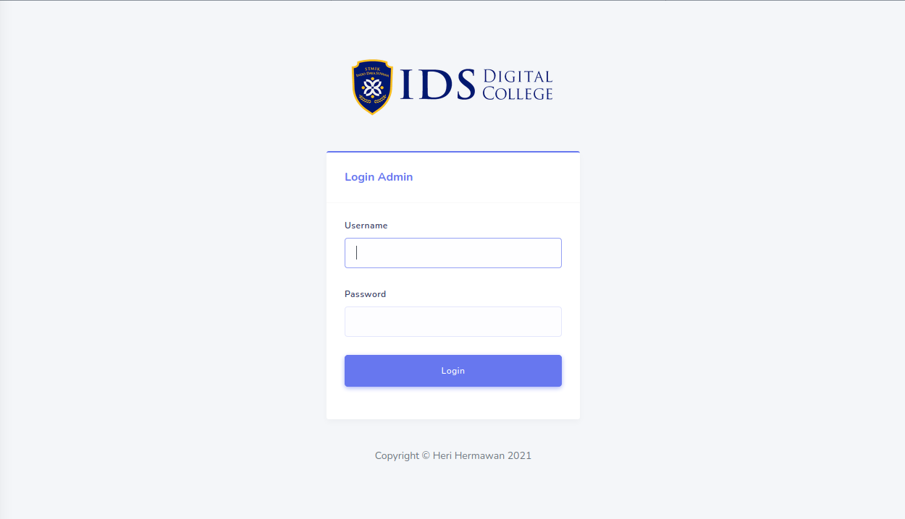
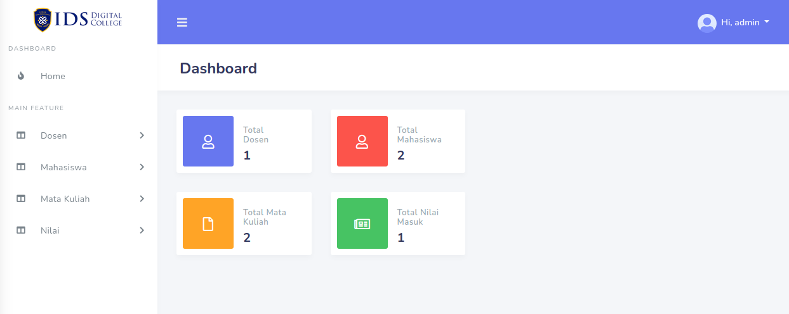
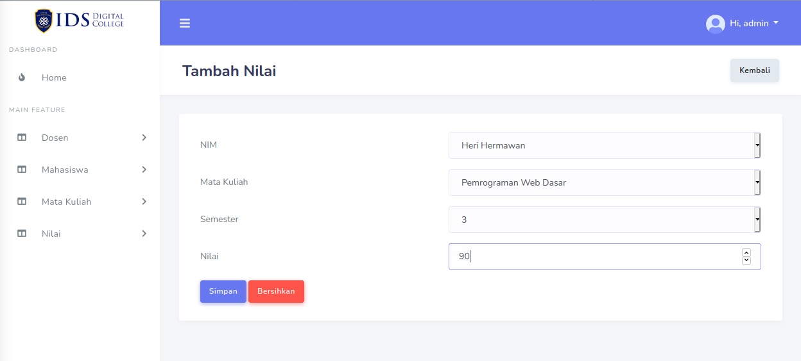
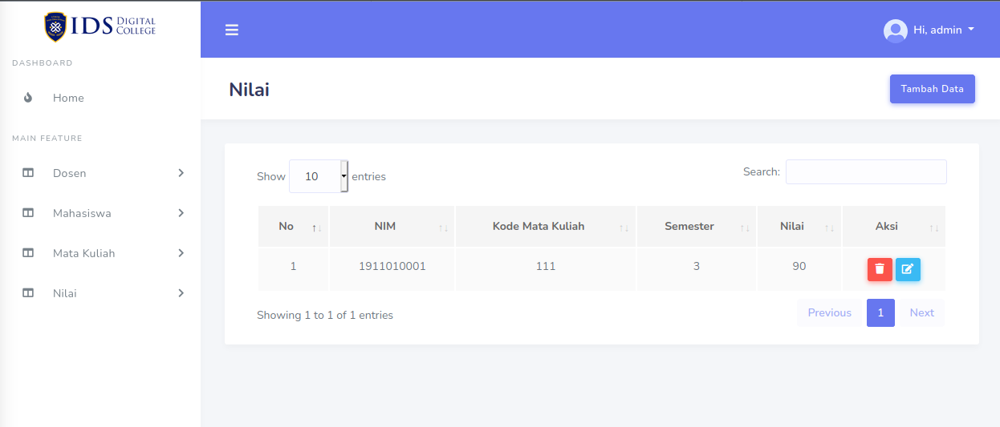

# php-native-dashboard

## Features
*  Login Admin
*  Tambah/Edit/Hapus Dosen
*  Tambah/Edit/Hapus Mahasiswa
*  Tambah/Edit/Hapus Mata Kuliah
*  Tambah/Edit/Hapus Nilai Mata Kuliah

## 📸 Demo Web
<pre>

 

</pre>

## 📁 Direktori
    # Root Project
    .
    ├── assets                 # Berisi css, js, bootstrap, foto.
    |
    ├── dashboard              # Halaman dashboard.
    |
    ├── data                   # File berisi db dan screenshoot demo.
    |
    ├── dosen                  # Halaman managemen dosen.
    |
    ├── helper                 # File untuk koneksi ke db dan autentikasi login user.
    |
    ├── layout                 # Template side, botton, top bar.
    |
    ├── mahasiswa              # Halaman managemen mahasiswa.
    |
    ├── matakuliah             # Halaman managemen mata kuliah.
    |
    └── nilai                  # Halaman managemen nilai.

## 📁 Git commit format
* Add
Use when add new feature
* Update
Use when update feature
* Fix
Use when fix some bug/error
* Remove
Use when remove some feature
#### Example :
    Add: Home page
    Fix: Layout not responsive
    Remove: Shadow on item list 
